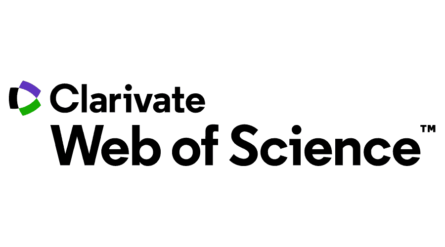
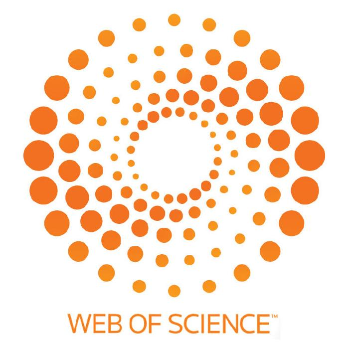

# Rogério Aparecido Gonçalves

Doutor em Ciência da Computação pelo Programa de Pós-Graduação em Ciência da Computação da Universidade de São Paulo (IME-USP). Bacharel em Informática pela Universidade Estadual de Maringá (2005) e Mestre em Ciência da Computação pela mesma instituição (2008). Professor do Ensino Básico, Técnico e Tecnológico no Departamento Acadêmico de Computação (DACOM) da Universidade Tecnológica Federal do Paraná (UTFPR), campus de Campo Mourão. Sou revisor do journal Springer Computing e de Conferências como o Simpósio Brasileiro de Sistemas Computacionais (WSCAD), do Workshop em Desempenho de Sistemas Computacionais e de Comunicação (WPerformance) do CSBC e da trilha Latin.Science do Latinoware. Líder do Grupo de Pesquisa [_Computação de Alto Desempenho e Sistemas Distribuídos da UTFPR_](dgp.cnpq.br/dgp/espelhogrupo/6083543477111893).

## Interesses

Tenho experiência na área de Ciência da Computação, tendo como principais linhas de pesquisa e de interesse Arquitetura de Computadores, Computação Paralela, Computação Heterogênea, Compiladores e _Runtimes_ voltados para Computação Paralela como `OpenMP` e `CUDA`. Sou um iniciante na área de _Blockchain_, buscando temas para pesquisa e desenvolvimento de aplicações.

## Atividade

  
## Contatos

<!---->

